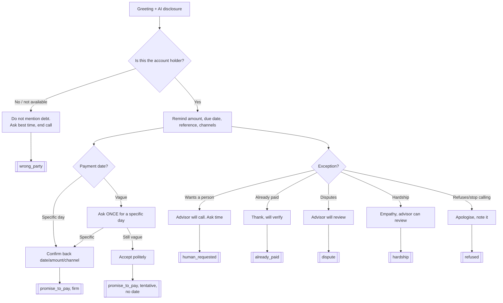

# 2. Voice agent design

CALL-E is **goal-driven**. You give it a natural-language `task` and a `result_schema`, and it plans the
conversation itself. You don't draw a dialogue tree. That makes it important to be explicit about which
behaviour sits in which layer.

## Where each behaviour is controlled

| Behaviour | Layer | Where |
|---|---|---|
| Explain purpose, identify as AI assistant of Solaria | **Instructions** | `agent_config.build_task` STEP 1 |
| Right-party check; never disclose debt to others | **Instructions**, enforced again by **external logic** | STEP 2; `outcomes.decide` turns `wrong_person` into a `wrong_party_contact` status regardless of other fields |
| Use customer context (name, amount, due date, reference, product) | **Workflow config**: data injected per call | `build_task(account, call_date)` |
| Ask for a date, clarify **once** if vague, don't pressure | **Instructions** | STEP 4 |
| Exceptions: human requested, dispute, hardship, already paid, refusal | **Instructions** (what to say) + **schema** (how to report) | EXCEPTIONS block + `outcome` enum |
| Forbidden: threats, discounts, card data, claiming to be human | **Instructions** | NEVER block |
| Language/locale/region | **Workflow config** | `recipients[].locale = es-MX`, `region = MX` |
| Structured output contract | **Workflow config** | `RESULT_SCHEMA` (enums, each with an `unknown` option) |
| Correlation with CRM | **Workflow config** | `metadata.account_id`, `cycle`, `schema_version` |
| One call per account per cycle | **Workflow config** + **external logic** | `Idempotency-Key: solaria-reminder-{cycle}-{account}` + local check |
| Who may be called, when | **External logic** | `guards.check_account`: phone present/valid, DNC, 08:00-21:00 local |
| Is a "promise" really a promise? | **External logic** | `outcomes.decide`: specific date, firm, within due + 7 days |
| What happens next (status, task, team, priority, SMS) | **External logic** | `outcomes.decide` → CRM |
| Retry / redial | **External logic** | Never automatic; failed calls create a review task |

**Principle:** the voice agent *reports what happened*. Solaria's code *decides what it means*. Prompts are
probabilistic. Anything with a compliance or money consequence is enforced in code we can test.

## Conversation flow

## Result schema (contract with CALL-E)

Required: `right_party`, `outcome`, `promise_certainty`, `needs_human`, `outcome_evidence`.

Design rules, from CALL-E's schema guidance:
- **String enums instead of booleans.** `will_pay: false` can't tell "no" apart from "nobody knew".
- **An explicit `unknown`** in every enum, with a description of when to use it, so the extractor doesn't
  pick the nearest confident label.
- **`promise_date` must be ISO `YYYY-MM-DD` or empty.** The description says "never guess a date". The
  task gives today's date so "el viernes" can be resolved.
- **`promise_certainty`** (firm/tentative) captures hedges like *"si puedo"*, which a date field can't.
- **`outcome_evidence`**: the customer's own words, kept verbatim for audit and QA.
- Only supported features are used: no `$ref`, `oneOf`, `anyOf`. `additionalProperties: false`.

Full schema: `GET http://127.0.0.1:8000/agent-config` or `app/orchestrator/agent_config.py`.

## Exceptions handled (the assignment asks for at least one)
| Exception | Handled by | Result |
|---|---|---|
| Missing information (no phone) | Guard, before the call | No call; CRM `contact_data_missing` + `fix_contact_data` task |
| Unclear response ("a fin de mes, si puedo") | Agent clarifies once; backend rule | `needs_review` + `confirm_promise` task; no SMS |
| Request for a human | Agent + routing | `callback_requested` + **high**-priority `human_callback` task with the preferred time |
| Wrong person answers | Agent (no disclosure) + privacy rule | `wrong_party_contact` + `verify_contact_data` task |
| No answer | CALL-E `call.failed` | `no_contact`, review task, **no auto-redial** |
| Extraction failed | CALL-E `call.result_validation_failed` | `needs_review` + QA task |
