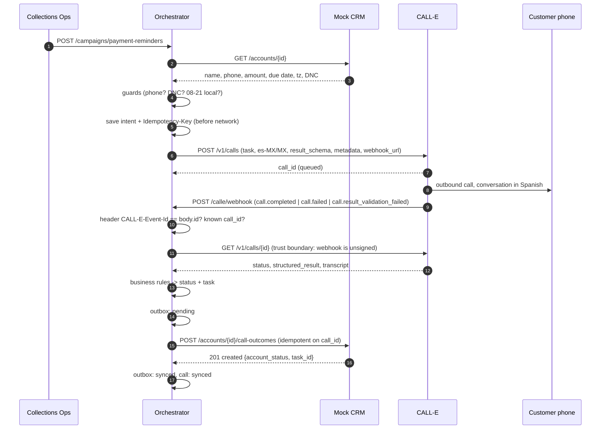

# 3. Integration

There are two integrations. Both execute over HTTP.

| # | Direction | Real? |
|---|---|---|
| I-1 | CRM → Orchestrator: read customer context (`GET /accounts/{id}`) | Real HTTP to a mock CRM service |
| I-2 | Orchestrator → CALL-E: create call (`POST /v1/calls`), verify (`GET /v1/calls/{id}`); CALL-E → Orchestrator: webhook | Real contract; execution is **live** with `CALLE_MODE=live`, otherwise **simulated** |
| I-3 | Orchestrator → CRM: write outcome + status + follow-up task (`POST /accounts/{id}/call-outcomes`) | Real HTTP to a mock CRM service |

## Sequence



## Input → output (normal path, ACC-1001)

**Input**: CRM account:
```json
{"account_id":"ACC-1001","full_name":"María Fernanda López García","phone_e164":"+525500000101",
 "timezone":"America/Mexico_City","amount_due_mxn":2450.0,"due_date":"2026-10-08",
 "installment_number":4,"payment_reference":"SOL-7781-1001","do_not_call":false}
```
**Request to CALL-E** (abridged): `task` (Spanish-call instructions with the values above),
`recipients:[{phones:["+525500000101"],region:"MX",locale:"es-MX"}]`, `result_schema`,
`metadata:{account_id:"ACC-1001",campaign:"payment-reminder",cycle:"2026-10",schema_version:"2026-10-v2"}`,
header `Idempotency-Key: solaria-reminder-2026-10-ACC-1001`.

**CALL-E structured_result**:
```json
{"right_party":"confirmed","outcome":"promise_to_pay","promise_date":"2026-10-09","promise_certainty":"firm",
 "promise_amount_mxn":2450.0,"payment_channel":"spei_transfer","needs_human":"no",
 "outcome_evidence":"El viernes nueve hago la transferencia por SPEI, los 2,450."}
```
**Output**: CRM. The account status becomes `promise_to_pay`, and an interaction plus a task are created:
```json
{"type":"verify_payment","team":"collections_ops","priority":"low","due_date":"2026-10-10",
 "description":"Promise to pay 2450.0 MXN on 2026-10-09. Verify payment received; if not, schedule follow-up."}
```
Full captured run: [`evidence/demo_run_simulated.txt`](evidence/demo_run_simulated.txt).

## Field mapping

| CRM (source) | → CALL-E request | | CALL-E result | → CRM (destination) |
|---|---|---|---|---|
| `full_name` | task: right-party check | | `right_party` | gates the outcome (privacy rule) |
| `amount_due_mxn`, `due_date`, `installment_number`, `product` | task: reminder text | | `outcome` | `interactions.outcome` and, via rules, `accounts.status` |
| `payment_reference` | task: reference to read out | | `promise_date` | `interactions.promise_date`; `tasks.due_date = promise + 1` |
| `phone_e164` | `recipients[0].phones[0]` | | `promise_certainty` | rule input (tentative → `needs_review`) |
| `timezone` | guard only (not sent) | | `promise_amount_mxn` | `interactions.promise_amount_mxn` |
| — | `region: MX`, `locale: es-MX` | | `payment_channel` | `interactions.payment_channel` |
| `account_id` | `metadata.account_id` | | `callback_window` | `interactions.callback_window`; task description |
| `do_not_call` | guard only | | `customer_notes` | `interactions.notes` |
| campaign cycle | `metadata.cycle`, `Idempotency-Key` | | `outcome_evidence` | `interactions.evidence` |
| | | | call `id` | `interactions.call_id` (CRM idempotency key) |
| | | | `simulated` flag | `interactions.source` = `calle_live` / `calle_simulated` |

Outcome → CRM routing (`app/orchestrator/outcomes.py`):

| Result | CRM status | Task → team (priority) |
|---|---|---|
| promise_to_pay, firm, valid date | `promise_to_pay` | verify_payment → collections_ops (low) + SMS link |
| promise_to_pay, vague/tentative/out of policy | `needs_review` | confirm_promise → collections_agents (normal) |
| already_paid | `paid_claimed` (**not** "paid") | reconcile_payment → finance |
| dispute | `dispute` | dispute_ticket → customer_support (high) |
| hardship | `hardship` | hardship_review → collections_specialists (high) |
| human_requested / callback_requested | `callback_requested` | human_callback → collections_agents (high / normal) |
| refused | `refused` | supervisor_review → collections_supervisors |
| wrong_party | `wrong_party_contact` | verify_contact_data → data_quality |
| call.failed / no_contact | `no_contact` | review_no_contact → collections_ops; **no auto-redial** |
| no / invalid structured_result | `needs_review` | review_call → qa |

## How success is confirmed
A CRM write counts as successful **only** when the CRM itself returns `201 {"result":"created"}` or
`200 {"result":"duplicate"}` (the same call was already recorded). Then:
- `outbox.state = synced` and `call_requests.state = synced`
- the webhook response carries `crm_confirmation` with the CRM's `task_id` and `account_status`
- the CRM dashboard shows the new status and task

A finished call is **not** the same thing as a successful business outcome. A `completed` CALL-E status only
means the call ended.

## What happens when data is missing or the integration fails

| Failure | Detection | Behaviour | Test |
|---|---|---|---|
| Phone missing / not +52 + 10 digits | Guard | No call. CRM `contact_data_missing` + task | T2b |
| DNC flag / outside 08:00-21:00 local | Guard | No call, reason returned | edge |
| CRM unreachable when reading accounts | `CrmError` | **Campaign aborted (502), zero calls** (we never call without context) | T3c |
| CALL-E rejects / unreachable on create | `GatewayError` | `submit_failed` recorded and reported; no CRM change | T3d |
| Webhook header/body id mismatch, unknown call id | Consistency checks | 400 / 202 ignored; nothing written | edge |
| Webhook body tampered | Re-fetch from CALL-E API | Tampered values are ignored | edge |
| CALL-E API down when verifying | `GatewayError` | **503** so CALL-E redelivers; `/calls/{id}/sync` polling fallback | T3b |
| No structured result / validation failed | Rules | `needs_review` + QA task; never a guessed outcome | edge |
| **CRM 5xx / timeout on write** | `CrmError(retryable)` | **202 `crm_sync: pending_retry`**, call `crm_sync_failed`, outbox `pending`. `POST /outbox/retry` delivers it later; the idempotent `call_id` prevents duplicates | **T3** |
| CRM 4xx (bad data) | `CrmError(non-retryable)` | Outbox `dead_letter` for a human to fix | — |
| Same webhook delivered twice | State `synced` / CRM duplicate | `duplicate`, single task | T3 |
