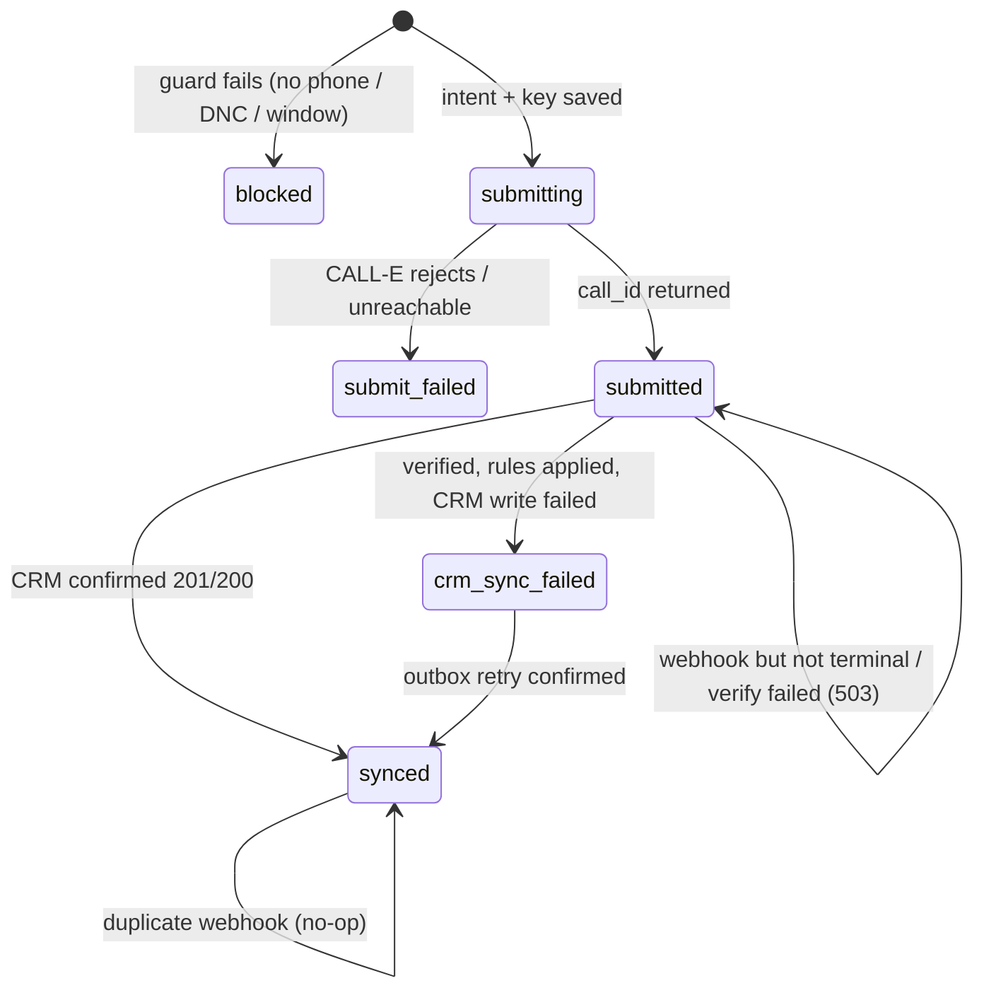

# Architecture

## System context

```mermaid
flowchart LR
  subgraph Solaria["Financiera Solaria (customer)"]
    OPS[Collections Ops]
    CRM[(Mock CRM :8001\nSIMULATED system\naccounts · interactions · tasks)]
    TEAMS[Human teams\ncollections · finance · support · data quality]
  end
  subgraph Ours["Integration layer (this repo) :8000"]
    CAMP[Campaign API]
    GUARD[Guards\nphone · DNC · 08-21 local]
    CFG[Agent config\ntask prompt · result_schema]
    GW[CALL-E Gateway\nlive SDK | simulator]
    WH[Webhook receiver\nid check · dedupe]
    RULES[Business rules\noutcome → status + task]
    OUT[(Outbox + state\nSQLite)]
  end
  subgraph CallE["CALL-E (AI Rudder)"]
    API[Developer API\nPOST/GET /v1/calls]
    VOICE[Voice agent\nes-MX, MX intl line]
  end
  CUST((Customer\nphone))

  OPS -->|start campaign| CAMP
  CAMP -->|GET /accounts| CRM
  CAMP --> GUARD --> CFG --> GW -->|POST /v1/calls\nIdempotency-Key| API
  API --> VOICE <-->|call| CUST
  API -->|webhook call.completed / failed| WH
  WH --> GW
  GW -->|GET /v1/calls/id\nverify| API
  WH --> RULES --> OUT -->|POST call-outcomes\nidempotent| CRM
  CRM --> TEAMS
```

## Responsibilities and sources of truth

| Owner | Source of truth for |
|---|---|
| CRM (Solaria) | Account data, account status, follow-up tasks |
| CALL-E | Call execution: status, transcript, extracted `structured_result` |
| Orchestrator | Business intent before calling, idempotency keys, call ↔ account link, webhook receipts, pending CRM writes |

## Call state machine (orchestrator)



## Trust boundaries
1. **Webhook → orchestrator:** unsigned. The body is used only as a wake-up signal. The `CALL-E-Event-Id`
   header must equal the body id, and the call id must be one we created.
2. **Orchestrator → CALL-E API:** authenticated with the API key. This is the only source for the outcome.
3. **Orchestrator → CRM:** writes count as successful only when the CRM confirms them. Writes are idempotent
   on `call_id`.
4. **Prompt → behaviour:** probabilistic. Anything with a compliance or money consequence is enforced in
   code (guards and rules).
